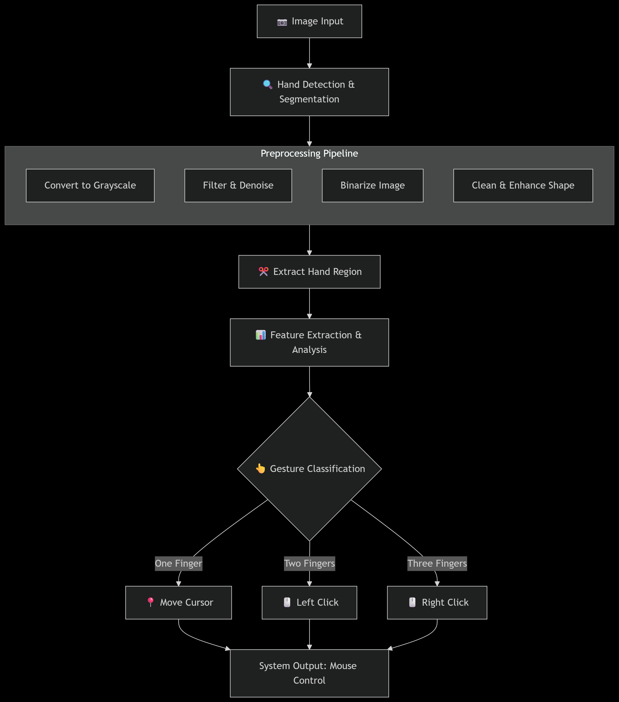

# 🖱️ Virtual Mouse Using Hand Gestures


An **AI-powered Virtual Mouse** that lets you control your computer using **hand gestures** ✋.
Built with **OpenCV, Mediapipe, and Autopy**, this project turns your webcam into a futuristic input device. 🚀

---

## 💡 Why This Project?

* Learn **computer vision** with a fun, practical build.
* Explore **gesture‑based interfaces** used in AR/VR & accessibility tech.
* Beginner‑friendly code with clear comments and modular design.

---

> **Compatibility Note**
> ✅ This project supports **Python 3.8.9** and **pip 3.8.9**.
> ⚠️ Using other versions **may show errors** (install/compatibility issues).

---

## 🌟 Features

* 🖐️ Real-time **Hand Gesture Recognition**
* 🖱️ Move cursor using just your **index finger**
* 👆 **Two fingers = Left Click**
* 👍 **Thumb + Forefinger = Right Click**
* ✋ **Open palm = Resume program**
* ✊ **Closed hand = Stop program**
* 🎥 Works with any **webcam**
* ⚡ Lightweight and beginner-friendly setup

---
## ✅ Requirements

* **Operating System:** Windows 10/11, macOS, or Ubuntu (with webcam access).
* **Python:** **3.8.9 only** (recommended).
* **pip:** **3.8.9** (paired with Python 3.8.9).
* **Camera:** Built‑in or USB webcam.

---
## 🛠️ Tech Stack

* **Python 3.8.9** → Core language (⚠️ Recommended version)
* **OpenCV** → Image processing
* **Mediapipe** → Hand tracking
* **Autopy** → Mouse movement and clicks
* **NumPy** → Computation

---

## 🔧 Installation Guide (Beginner Friendly)

1. **Clone the Repository**

    ```
    git clone https://github.com/prince1604/Ctrl-Gesture.git
    cd AI-Virtual-Mouse
    ```

2. **Create a Virtual Environment (Optional but Recommended)**

    ```bash
    python -m venv .venv
    source .venv/bin/activate   # Linux/Mac
    .venv\Scripts\activate      # Windows
    ```

3. **Verify versions**

   ```bash
   python --version   # should be 3.8.9
   pip --version      # paired with Python 3.8.9
   ```
4. **Install dependencies**

   ```bash
   pip install --upgrade pip
   pip install -r requirements.txt
   ```
5. **Run the app**

   ```bash
   python aivirtualmouseproject.py
   ```


✅ If you face issues, ensure **Python & pip version = 3.8.9**. Otherwise, errors may appear.
💌 For help, contact: **[princekothiya1604@gmail.com](mailto:princekothiya1604@gmail.com)**

---

## 🎮 How to Use

1. Place your **hand in front of the camera**.
2. Gestures:

   * 👉 One finger → Move cursor
   * ✌️ Two fingers → Left click  
   * 🤟 Three fingers → Right click  
   * ✋ Open palm → Resume program
   * ✊ All fingers closed → Stop program
3. To exit, press **Ctrl + C** or close the window.


---

## 🔧 Configuration Tips

You can tweak behavior in `aivirtualmouseproject.py`:

* **Camera index** (default webcam = `0`):

  ```python
  cap = cv2.VideoCapture(0)  # try 1 or 2 if you have multiple cameras
  ```
* **Resolution** (smoother on low‑end systems):

  ```python
  wCam, hCam = 640, 480
  cap.set(3, wCam)
  cap.set(4, hCam)
  ```
* **Smoothing & frame reduction** (reduce jitter):

  ```python
  frameR = 100        # reduce active region near edges
  smoothening = 7     # increase to reduce cursor jitter
  ```

---

## 🧰 Troubleshooting (Beginner Friendly)

**1) Camera not opening / Black window**

* Close other apps using the camera (Zoom/Meet).
* Change camera index: `cv2.VideoCapture(0)` → `cv2.VideoCapture(1)` or `2`.

**2) `ModuleNotFoundError: cv2 / mediapipe / autopy`**

* Ensure your **virtual environment is activated** before installing.
* Run: `pip install -r requirements.txt`.

**3) AutoPy fails to install (Windows)**

* Install **Build Tools for Visual Studio** (C++ tools) if prompted.
* If issues persist, try: `pip install pyautogui` and adapt code to use PyAutoGUI for mouse control.

**4) macOS: “App needs camera access”**

* Go to **System Settings → Privacy & Security → Camera** and allow Terminal/IDE access.

**5) Cursor is jittery / laggy**

* Increase `smoothening` value and ensure good lighting.
* Lower camera resolution to `640×480`.

**6) Wrong Python version detected**

* Install **Python 3.8.9** and re‑run

If you still face issues, feel free to **contact** me (see below). I usually respond quickly.

---

## 🗂️ Project Structure

```
AI-Virtual-Mouse/
├─ aivirtualmouseproject.py     # Main application (run this)
├─ HandTrackingModule.py        # Hand landmark detection utils
├─ volume.py                    # (Optional) volume control via gestures
├─ requirements.txt             # Pinned dependencies
├─ README.md                    # This file
└─ LICENSE                      # MIT License
```
---

## 📊 Workflow (Easy-to-Understand Diagram)

  


**Simple Steps in Workflow:**

1. Capture **Image Input** 🎥
2. Detect & Segment Hand ✋
3. Preprocess → Grayscale, Filter, Enhance 🖼️
4. Extract Hand Region ✂️
5. Analyze Features 🔍
6. Classify Gesture 🤖
7. Perform Mouse Action 🖱️

---

## 🤝 Contributing

We ❤️ contributions!

1. **Fork** the repo
2. **Create a feature branch** (`feat/your‑idea`)
3. **Commit** your changes
4. **Open a Pull Request**

For major features, please open an **issue** first to discuss your proposal.

---

## 📜 License

Licensed under **MIT License** – see [LICENSE](LICENSE).

---
## 📬 Contact

Questions or bugs? Email **[princekothiya1604@gmail.com](mailto:princekothiya1604@gmail.com)**
You can also open a **GitHub Issue** with detailed logs/screenshots.
---
